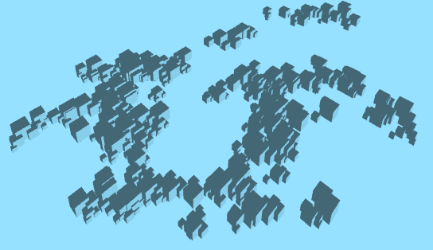
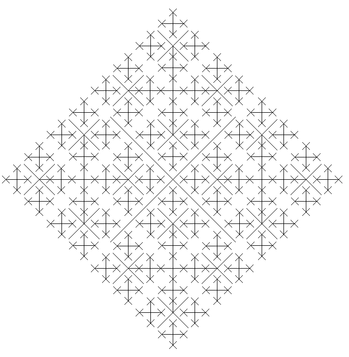

Original Fractal
===============

In this assignment you will create your own original fractal design. You can create  fractals with circles, squares, polygons or any other shape. You may want to search the web for ideas, or try to come up with your own variation. Vi Hart has an excellent youtube video "Infinity Elephants" which describes many similar fractals. Your program doesn't have to look or work like any other, have fun and be creative.

Samples of Student Work
-----------------------
[Zachary](http://zachooz.github.io/OriginalFractal/)
   
   
